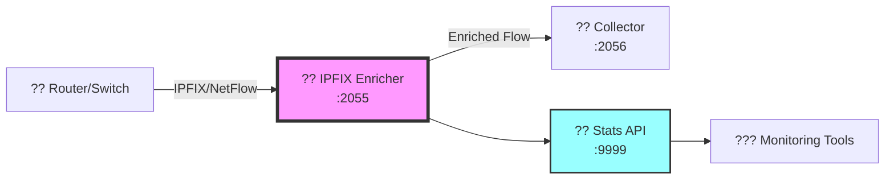

<div align="center">

# ?? IPFIX AS Enricher

[](https://opensource.org/licenses/MIT)
[](https://www.python.org/downloads/)
[](https://ubuntu.com/)
[](https://www.debian.org/)
[](https://systemd.io/)
[](https://www.cisco.com/c/en/us/products/ios-nx-os-software/ios-netflow/index.html)
[](https://tools.ietf.org/html/rfc7011)

**Extract AS numbers from IPFIX/NetFlow traffic in real-time**

[Features](#features) • [Installation](#installation) • [Usage](#usage) • [Monitoring](#monitoring-tools) • [Documentation](#documentation)

</div>

---

## ?? Overview

IPFIX AS Enricher is a high-performance packet processor that enriches IPFIX and NetFlow v9 flow data with Autonomous System (AS) information extracted directly from the flow packets.

<div align="center">


</div>

## ?? What is this project?

This project acts as a transparent proxy for IPFIX/NetFlow traffic, sitting between your network devices and flow collectors to extract and enrich AS information.

### The Problem
- ?? Network flow data lacks proper AS identification
- ?? Manual AS lookups don't scale
- ?? Replacing collectors is expensive
- ? Real-time analysis is challenging

### The Solution
- ? **Intercepts** flow packets transparently
- ? **Extracts** AS numbers in real-time
- ? **Enriches** data with AS information
- ? **Forwards** to existing collectors
- ? **Monitors** everything live

## ??? Architecture



## ? Features

### ?? Core Features
- **Multi-Protocol Support**: IPFIX and NetFlow v9
- **AS Extraction**: Real-time AS number identification  
- **High Performance**: 100,000+ flows/second
- **Zero-Copy**: Minimal latency addition (<1ms)
- **Thread-Safe**: Multi-threaded packet processing

### ?? Monitoring & Management
- **Live Statistics**: Telnet interface on port 9999
- **Monitoring Tools**: Real-time packet viewer, stats dashboard
- **systemd Integration**: Production-ready service management
- **Prometheus Metrics**: Export statistics for monitoring

### ??? Production Features
- **CSF Compatible**: Tested with ConfigServer Firewall
- **NAT Support**: Complex routing scenarios handled
- **Auto-Restart**: Automatic recovery on failure
- **Log Rotation**: Integrated with logrotate

## ?? Quick Start

### Prerequisites
- Ubuntu 20.04+ or Debian 10+
- Python 3.8+
- Root access

### Installation

```bash
# Clone repository
git clone https://github.com/paolokappa/ipfix-as-enricher.git
cd ipfix-as-enricher

# Run installer
sudo ./install.sh

# Configure
sudo nano /etc/ipfix-enricher/config.yaml

# Start service
sudo systemctl start ipfix-enricher
sudo systemctl enable ipfix-enricher
```

## ?? Configuration

```yaml
general:
  listen_port: 2055      # Where to receive flows
  output_port: 2056      # Where to send enriched flows
  stats_port: 9999       # Statistics interface

enrichment:
  as_extraction: true    # Enable AS extraction
```

## ?? Monitoring Tools

| Tool | Purpose | Usage |
|------|---------|--------|
| ?? `ipfix-monitor` | Live packet viewer | `ipfix-monitor` |
| ?? `ipfix-stats` | Statistics dashboard | `ipfix-stats` |
| ?? `ipfix-tail` | Enhanced log viewer | `ipfix-tail` |
| ? `ipfix-status` | Health check | `ipfix-status` |

### Example Output
```bash
$ ipfix-stats
+--------------------------------------+
¦      IPFIX AS Enricher Stats         ¦
¦--------------------------------------¦
¦ Uptime:          2d 14h 23m          ¦
¦ Packets:         145,234,891         ¦
¦ Rate:            12,453 pkt/s        ¦
¦ AS Numbers:      4,521 unique        ¦
¦ Top AS:          AS15169 (Google)    ¦
+--------------------------------------+
```

## ?? Performance

<div align="center">

| Metric | Value |
|--------|-------|
| ?? Throughput | 100,000+ flows/sec |
| ?? Latency | <1ms added delay |
| ?? Memory | ~50MB base usage |
| ?? CPU | 1 core per 50k flows/sec |

</div>

## ?? Firewall Configuration

> ?? **Important**: Special configuration needed for CSF users!

See [docs/FIREWALL.md](docs/FIREWALL.md) for complete firewall setup, especially if using:
- ConfigServer Firewall (CSF)
- Complex NAT scenarios
- Custom ports (e.g., 9996)

## ?? Troubleshooting

Quick diagnostics:
```bash
# Check service
sudo systemctl status ipfix-enricher

# Run firewall diagnostic
sudo ./scripts/diagnose-firewall.sh

# View logs
sudo journalctl -u ipfix-enricher -f
```

See [docs/TROUBLESHOOTING.md](docs/TROUBLESHOOTING.md) for detailed troubleshooting.

## ?? Documentation

- ?? [Installation Guide](docs/INSTALL.md)
- ?? [Configuration Guide](docs/CONFIGURATION.md)
- ?? [Firewall Setup](docs/FIREWALL.md)
- ?? [Monitoring Tools](docs/MONITORING_TOOLS.md)
- ??? [Architecture](docs/ARCHITECTURE.md)
- ?? [Troubleshooting](docs/TROUBLESHOOTING.md)

## ?? Contributing

Contributions are welcome! See [CONTRIBUTING.md](CONTRIBUTING.md) for guidelines.

## ?? License

This project is licensed under the MIT License - see [LICENSE](LICENSE) file.

## ?? Author

**Paolo Kappa** - 2024

---

<div align="center">

### ? Star this repo if you find it useful!

[](https://github.com/paolokappa/ipfix-as-enricher/stargazers)
[](https://github.com/paolokappa/ipfix-as-enricher/watchers)

</div>
